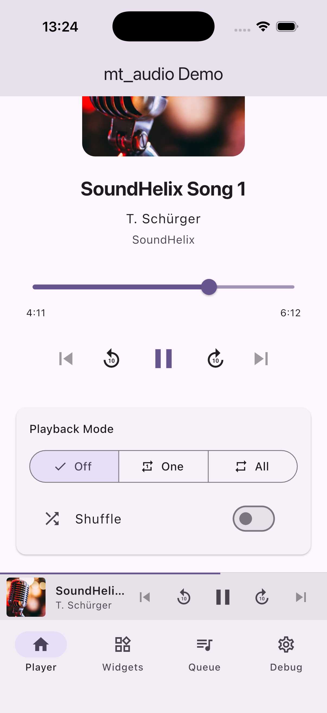
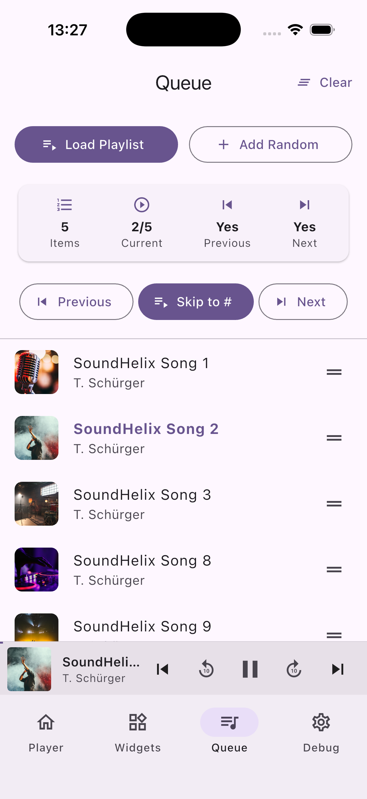
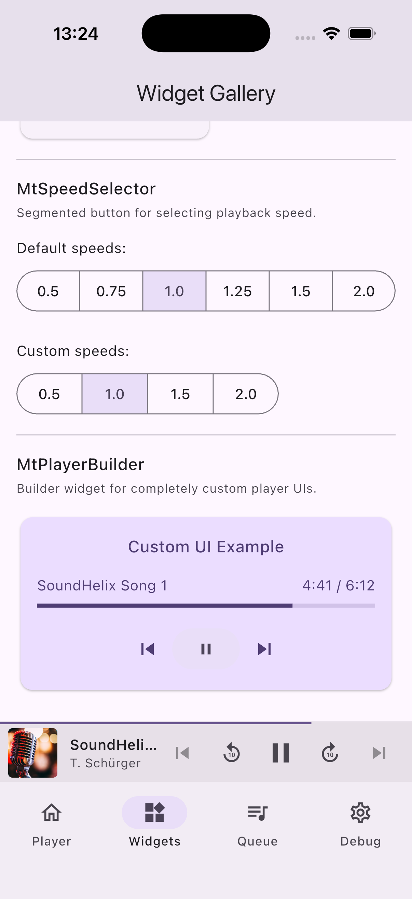
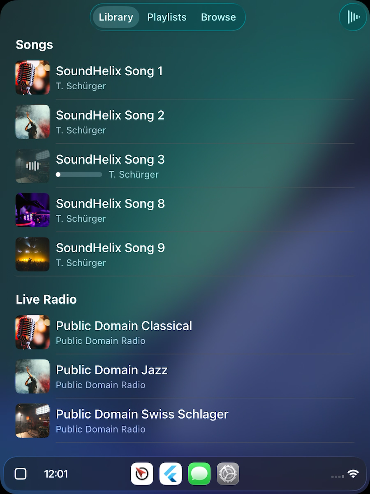
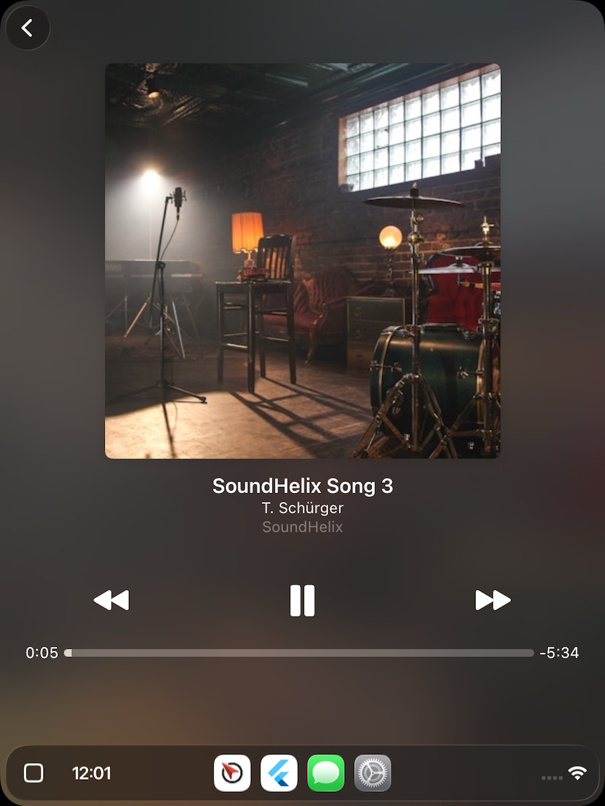

# mt_audio


A production-ready, streams-based audio module for Flutter. Provides background playback, system notifications, queue management, and first-class **Android Auto** & **Apple CarPlay** support -- all behind a single facade class and zero external state management dependencies.

<p align="center">
  
  
  
</p>

---

## Features

- **Background playback** with lock screen controls and media notifications
- **Queue management** -- add, insert, remove, reorder, shuffle
- **Seek forward / backward** with configurable intervals
- **Playback speed** control (0.5x -- 2.0x)
- **Repeat modes** -- off, one, all
- **Live stream** support with ICY metadata
- **Android Auto** integration via delegate pattern
- **Apple CarPlay** integration with list, grid, and tab bar templates
- **Pre-built widgets** -- seek bar, play/pause, skip, speed selector, queue list, artwork, now playing info, and a full player builder
- **State management agnostic** -- pure Dart `BehaviorSubject` streams with synchronous getters
- **Audio session handling** -- automatic interruption and becoming-noisy management

## Core Stack

| Package | Version | Purpose |
|---------|---------|---------|
| [just_audio](https://pub.dev/packages/just_audio) | ^0.10.5 | Audio playback engine |
| [audio_service](https://pub.dev/packages/audio_service) | ^0.18.18 | Background playback & notifications |
| [audio_session](https://pub.dev/packages/audio_session) | ^0.2.2 | Audio session & interruption handling |
| [mt_carplay](https://pub.dev/packages/mt_carplay) | custom fork | Apple CarPlay integration |
| [rxdart](https://pub.dev/packages/rxdart) | ^0.28.0 | Stream utilities & BehaviorSubjects |
| [equatable](https://pub.dev/packages/equatable) | ^2.0.8 | Value equality for models |

---

## Installation

Add to your `pubspec.yaml`:

```yaml
dependencies:
  mt_audio: ^0.1.0
```

---

## Platform Setup

### Android

#### 1. AndroidManifest.xml

Open `android/app/src/main/AndroidManifest.xml` and apply the following changes.

Add the `tools` namespace to the root `<manifest>` element:

```xml
<manifest xmlns:android="http://schemas.android.com/apk/res/android"
    xmlns:tools="http://schemas.android.com/tools">
```

Add required permissions:

```xml
<uses-permission android:name="android.permission.INTERNET"/>
<uses-permission android:name="android.permission.WAKE_LOCK"/>
<uses-permission android:name="android.permission.FOREGROUND_SERVICE"/>
<uses-permission android:name="android.permission.FOREGROUND_SERVICE_MEDIA_PLAYBACK"/>
```

Replace the default activity class name with the `audio_service` wrapper:

```xml
<activity android:name="com.ryanheise.audioservice.AudioServiceActivity" ...>
  ...
</activity>
```

Add the audio service and media button receiver inside `<application>`:

```xml
<service android:name="com.ryanheise.audioservice.AudioService"
    android:foregroundServiceType="mediaPlayback"
    android:exported="true"
    tools:ignore="Instantiatable">
    <intent-filter>
        <action android:name="android.media.browse.MediaBrowserService" />
    </intent-filter>
</service>

<receiver android:name="com.ryanheise.audioservice.MediaButtonReceiver"
    android:exported="true"
    tools:ignore="Instantiatable">
    <intent-filter>
        <action android:name="android.intent.action.MEDIA_BUTTON" />
    </intent-filter>
</receiver>
```

#### 2. HTTP streaming (optional)

If you stream audio over plain HTTP (not HTTPS), add to the `<application>` element:

```xml
<application ... android:usesCleartextTraffic="true">
```

#### 3. Android Auto (optional)

To enable Android Auto media browsing, create `android/app/src/main/res/xml/automotive_app_desc.xml`:

```xml
<automotiveApp>
    <uses name="media"/>
</automotiveApp>
```

Then reference it in your `AndroidManifest.xml` inside `<application>`:

```xml
<meta-data
    android:name="com.google.android.gms.car.application"
    android:resource="@xml/automotive_app_desc"/>
```

### iOS

#### 1. Info.plist

Add background audio mode to `ios/Runner/Info.plist`:

```xml
<key>UIBackgroundModes</key>
<array>
    <string>audio</string>
</array>
```

If streaming over plain HTTP, also add:

```xml
<key>NSAppTransportSecurity</key>
<dict>
    <key>NSAllowsArbitraryLoads</key>
    <true/>
</dict>
```

#### 2. CarPlay (optional)

CarPlay requires additional setup. See the [Apple CarPlay Integration](#apple-carplay-integration) section below.

**Podfile** -- ensure minimum iOS 14.0:

```ruby
platform :ios, '14.0'
```

**AppDelegate.swift** -- replace with a shared Flutter engine to support both phone and CarPlay scenes:

```swift
import UIKit
import Flutter

let flutterEngine = FlutterEngine(
    name: "SharedEngine", project: nil, allowHeadlessExecution: true
)

@UIApplicationMain
@objc class AppDelegate: FlutterAppDelegate {
    override func application(
        _ application: UIApplication,
        didFinishLaunchingWithOptions launchOptions: [UIApplication.LaunchOptionsKey: Any]?
    ) -> Bool {
        flutterEngine.run()
        GeneratedPluginRegistrant.register(with: flutterEngine)
        return super.application(application, didFinishLaunchingWithOptions: launchOptions)
    }
}
```

**SceneDelegate.swift** -- create `ios/Runner/SceneDelegate.swift`:

```swift
@available(iOS 13.0, *)
class SceneDelegate: UIResponder, UIWindowSceneDelegate {
    var window: UIWindow?

    func scene(_ scene: UIScene, willConnectTo session: UISceneSession,
               options connectionOptions: UIScene.ConnectionOptions) {
        guard let windowScene = scene as? UIWindowScene else { return }
        window = UIWindow(windowScene: windowScene)
        let controller = FlutterViewController(
            engine: flutterEngine, nibName: nil, bundle: nil
        )
        controller.loadDefaultSplashScreenView()
        window?.rootViewController = controller
        window?.makeKeyAndVisible()
    }
}
```

**Info.plist** -- add scene manifest with both phone and CarPlay scenes:

```xml
<key>UIApplicationSceneManifest</key>
<dict>
    <key>UIApplicationSupportsMultipleScenes</key>
    <true/>
    <key>UISceneConfigurations</key>
    <dict>
        <key>CPTemplateApplicationSceneSessionRoleApplication</key>
        <array>
            <dict>
                <key>UISceneConfigurationName</key>
                <string>CarPlay Configuration</string>
                <key>UISceneDelegateClassName</key>
                <string>mt_carplay.FlutterCarPlaySceneDelegate</string>
            </dict>
        </array>
        <key>UIWindowSceneSessionRoleApplication</key>
        <array>
            <dict>
                <key>UISceneConfigurationName</key>
                <string>Default Configuration</string>
                <key>UISceneDelegateClassName</key>
                <string>$(PRODUCT_MODULE_NAME).SceneDelegate</string>
                <key>UISceneStoryboardFile</key>
                <string>Main</string>
            </dict>
        </array>
    </dict>
</dict>
```

**Entitlements** -- in Xcode, enable the `com.apple.developer.carplay-audio` entitlement. You must first request CarPlay Audio access from Apple via https://developer.apple.com/contact/carplay and update your provisioning profile.

---

## Quick Start

### Initialize the player

```dart
import 'package:mt_audio/mt_audio.dart';

final player = await MtAudioPlayer.init(
  config: MtAudioPlayerConfig(
    notificationChannelId: 'audio_playback',
    notificationChannelName: 'Audio Playback',
    notificationIcon: 'mipmap/ic_launcher',
    ffRewindInterval: Duration(seconds: 10),
  ),
);
```

### Set an audio source

`MtAudioSource` is a sealed class with three variants:

```dart
// Single track
await player.setSource(
  MtSingleSource(
    item: MtAudioItem(
      id: '1',
      uri: Uri.parse('https://example.com/audio.mp3'),
      title: 'My Song',
      artist: 'Artist Name',
      artworkUri: Uri.parse('https://example.com/artwork.jpg'),
      duration: Duration(minutes: 3, seconds: 45),
    ),
  ),
);

// Playlist
await player.setSource(
  MtPlaylistSource(
    items: [item1, item2, item3],
    initialIndex: 0,
  ),
);

// Live stream
await player.setSource(
  MtLiveSource(
    item: MtAudioItem(
      id: 'live',
      uri: Uri.parse('https://example.com/stream'),
      title: 'Live Radio',
      isLive: true,
    ),
  ),
);
```

### Control playback

```dart
await player.play();
await player.pause();
await player.stop();

// Seeking
await player.seekTo(Duration(seconds: 30));
await player.seekForward();
await player.seekBackward();

// Queue navigation
await player.skipToNext();
await player.skipToPrevious();
await player.skipToIndex(2);

// Playback modes
await player.setRepeatMode(MtRepeatMode.all);
await player.setShuffleMode(true);
await player.setSpeed(1.5);
await player.setVolume(0.8);
```

### Listen to state changes

All state is exposed via `BehaviorSubject` streams that always hold a current value. Synchronous getters (e.g. `player.currentPlaybackState`) are available for one-off reads.

```dart
// Playback state
player.playbackStateStream.listen((state) {
  print('Status: ${state.status}');   // MtPlaybackStatus enum
  print('Playing: ${state.isPlaying}');
  print('Speed: ${state.speed}');
  print('Repeat: ${state.repeatMode}');
});

// Position updates
player.positionStateStream.listen((state) {
  print('Position: ${state.position}');
  print('Duration: ${state.duration}');
  print('Progress: ${state.progress}'); // 0.0 to 1.0
});

// Queue updates
player.queueStateStream.listen((state) {
  print('Queue: ${state.queue.length} items');
  print('Index: ${state.queueIndex}');
  print('Has next: ${state.hasNext}');
});

// Current item
player.currentItemStream.listen((item) {
  print('Now playing: ${item?.title}');
});

// Errors
player.errorStream.listen((error) {
  if (error != null) {
    print('Error [${error.code}]: ${error.message}');
  }
});

// ICY metadata (live streams)
player.icyMetadataStream.listen((metadata) {
  print('Stream title: ${metadata?.info?.title}');
});
```

### Manage the queue

```dart
await player.addToQueue(newItem);
await player.insertInQueue(2, newItem);
await player.removeFromQueue(3);
await player.reorderQueue(oldIndex: 2, newIndex: 5);
await player.clearQueue();
```

---

## Widgets

All widgets take `MtAudioPlayer player` as a required parameter and use `StreamBuilder` internally -- no external state management needed.

### Seek Bar

```dart
MtSeekBar(
  player: player,
  showLabels: true,
)
```

### Play / Pause Button

```dart
MtPlayPauseButton(
  player: player,
  size: 64.0,
  color: Colors.white,
  playIcon: Icons.play_arrow,   // customizable
  pauseIcon: Icons.pause,       // customizable
)
```

### Skip Buttons (fast forward / rewind by interval)

```dart
Row(
  children: [
    MtSkipButton(player: player, direction: MtSkipDirection.backward),
    MtPlayPauseButton(player: player),
    MtSkipButton(player: player, direction: MtSkipDirection.forward),
  ],
)
```

### Track Skip Buttons (next / previous track)

```dart
Row(
  children: [
    MtTrackSkipButton(player: player, direction: MtTrackSkipDirection.previous),
    MtPlayPauseButton(player: player),
    MtTrackSkipButton(player: player, direction: MtTrackSkipDirection.next),
  ],
)
```

### Speed Selector

```dart
MtSpeedSelector(
  player: player,
  speeds: [0.5, 0.75, 1.0, 1.25, 1.5, 2.0],
)
```

### Artwork & Now Playing Info

```dart
Column(
  children: [
    MtArtwork(
      artworkUri: player.currentItem?.artworkUri,
      size: 300,
      borderRadius: 8.0,
    ),
    SizedBox(height: 16),
    MtNowPlayingInfo(
      player: player,
      showAlbum: true,
    ),
  ],
)
```

### Queue List

```dart
MtQueueListView(
  player: player,
  enableReorder: true,
  enableDismiss: true,
)
```

### Custom UI with MtPlayerBuilder

`MtPlayerBuilder` combines all player streams into a single `MtPlayerState` object, making it easy to build fully custom UIs:

```dart
MtPlayerBuilder(
  player: player,
  builder: (context, state) {
    return Column(
      children: [
        Text(state.currentItem?.title ?? 'No track'),
        Text('${state.position} / ${state.duration}'),
        Slider(
          value: state.progress,
          onChanged: (value) {
            final duration = state.duration;
            if (duration != null) {
              player.seekTo(Duration(
                milliseconds: (value * duration.inMilliseconds).round(),
              ));
            }
          },
        ),
        Row(
          mainAxisAlignment: MainAxisAlignment.center,
          children: [
            IconButton(
              icon: Icon(Icons.skip_previous),
              onPressed: player.skipToPrevious,
            ),
            IconButton(
              icon: Icon(state.isPlaying ? Icons.pause : Icons.play_arrow),
              onPressed: state.isPlaying ? player.pause : player.play,
            ),
            IconButton(
              icon: Icon(Icons.skip_next),
              onPressed: player.skipToNext,
            ),
          ],
        ),
      ],
    );
  },
)
```

`MtPlayerState` exposes: `playbackState`, `positionState`, `queueState`, `currentItem`, `speed`, `isPlaying`, `isPaused`, `isLoading`, `position`, `duration`, `progress`.

---

## Android Auto Integration

### 1. Implement the delegate

```dart
class MyAndroidAutoDelegate implements MtAndroidAutoDelegate {
  MyAndroidAutoDelegate({required this.player});
  final MtAudioPlayer player;

  @override
  Future<List<MtMediaLibraryItem>> getChildren(String? parentMediaId) async {
    if (parentMediaId == null || parentMediaId == 'root') {
      return const [
        MtBrowsableItem(id: 'songs', title: 'Songs'),
        MtBrowsableItem(id: 'radio', title: 'Live Radio'),
      ];
    }

    if (parentMediaId == 'songs') {
      return tracks.map((t) => MtPlayableItem(item: t)).toList();
    }

    return [];
  }

  @override
  Future<void> onPlayFromMediaId(String mediaId) async {
    final track = await repository.getTrackById(mediaId);
    await player.setSource(MtSingleSource(item: track));
    await player.play();
  }

  @override
  Future<List<MtAudioItem>> search(String query) async {
    return tracks.where((t) => t.title.contains(query)).toList();
  }

  @override
  void onConnect() {}

  @override
  void onDisconnect() {}
}
```

**Item types:**

| Type | Use Case |
|------|----------|
| `MtBrowsableItem` | Folders, categories, playlists (navigable) |
| `MtPlayableItem` | Audio tracks (triggers `onPlayFromMediaId` on tap) |

### 2. Pass factory during initialization

The delegate factory receives the `MtAudioPlayer` instance, solving the circular dependency:

```dart
final player = await MtAudioPlayer.init(
  config: MtAudioPlayerConfig(
    notificationChannelId: 'audio',
    notificationChannelName: 'Audio',
    androidAutoDelegateFactory: (player) =>
        MyAndroidAutoDelegate(player: player),
  ),
);
```

---

## Apple CarPlay Integration

<p align="center">
  
  
</p>

### 1. Implement the delegate

```dart
class MyCarPlayDelegate extends MtCarPlayDelegate {
  MyCarPlayDelegate({required this.player});
  final MtAudioPlayer player;

  @override
  MtCarPlayRootConfig get rootConfig => MtCarPlayRootConfig.list(
    title: 'My Music App',
    systemIcon: 'music.note.list',
  );

  @override
  Future<List<MtCarPlayItem>> getChildren(String? parentId) async {
    if (parentId == null) {
      return [
        MtCarPlayBrowsableItem(id: 'songs', title: 'Songs', subtitle: '5 tracks'),
        MtCarPlayBrowsableItem(
          id: 'genres',
          title: 'Genres',
          templateType: MtCarPlayTemplateType.grid,
        ),
      ];
    }

    if (parentId == 'songs') {
      return tracks.map((t) => MtCarPlayPlayableItem(item: t)).toList();
    }

    return [];
  }

  @override
  Future<void> onPlayFromMediaId(String mediaId) async {
    final track = await repository.getTrackById(mediaId);
    await player.setSource(MtSingleSource(item: track));
    await player.play();
  }
}
```

**Item types:**

| Type | Use Case |
|------|----------|
| `MtCarPlayBrowsableItem` | Folders, categories, playlists (navigable). Set `templateType` to `.grid` for image-based layouts. |
| `MtCarPlayPlayableItem` | Audio tracks (triggers `onPlayFromMediaId` on tap) |

### 2. Sections with headers (optional)

Override `getSections` for grouped content with section headers:

```dart
@override
Future<List<MtCarPlaySection>> getSections(String? parentId) async {
  if (parentId == null) {
    return [
      MtCarPlaySection(
        header: 'Recently Played',
        items: recentTracks.map((t) => MtCarPlayPlayableItem(item: t)).toList(),
      ),
      MtCarPlaySection(
        header: 'Browse',
        items: [
          MtCarPlayBrowsableItem(id: 'songs', title: 'All Songs'),
          MtCarPlayBrowsableItem(id: 'albums', title: 'Albums'),
        ],
      ),
    ];
  }
  return super.getSections(parentId);
}
```

### 3. Tab Bar root template (optional)

For apps with multiple content categories, use a tab bar at root level:

```dart
@override
MtCarPlayRootConfig get rootConfig => MtCarPlayRootConfig.tabBar(
  title: 'My Music App',
  tabBarConfig: MtCarPlayTabBarConfig(
    tabs: [
      MtCarPlayTab(title: 'Library', systemIcon: 'music.note.house', rootId: 'library'),
      MtCarPlayTab(title: 'Playlists', systemIcon: 'list.bullet', rootId: 'playlists'),
      MtCarPlayTab(title: 'Radio', systemIcon: 'radio', rootId: 'radio'),
    ],
  ),
);
```

### 4. Pass factory during initialization

```dart
final player = await MtAudioPlayer.init(
  config: MtAudioPlayerConfig(
    notificationChannelId: 'audio',
    notificationChannelName: 'Audio',
    carPlayDelegateFactory: (player) =>
        MyCarPlayDelegate(player: player),
  ),
);
```

### 5. Programmatic control

```dart
final carPlay = player.carPlay;

// Connection status
if (carPlay?.isConnected ?? false) { ... }
carPlay?.connectionStream.listen((connected) { ... });

// Navigation
await carPlay?.refresh();       // Reload content after data changes
await carPlay?.pop();
await carPlay?.popToRoot();
await carPlay?.showNowPlaying();
```

### CarPlay capabilities

| Feature | Description |
|---------|-------------|
| Auto state sync | Playback state and progress automatically synced to the CarPlay UI |
| Nested navigation | Up to 5 levels deep (CarPlay platform limit) |
| List templates | Vertical scrolling lists with optional section headers |
| Grid templates | Image-based navigation for visual content |
| Tab bar | Multiple content categories at root level |
| Now Playing | Automatic transition to Now Playing screen after playback starts |

---

## Architecture

```
Consumer App
    |
    v
MtAudioPlayer  (public facade -- single entry point)
    |
    +---> MtAudioHandler       (internal: bridges just_audio <-> audio_service)
    +---> MtAudioSessionManager (internal: audio interruptions & becoming noisy)
    +---> MtCarPlayHandler      (public: CarPlay lifecycle & templates)
```

- **MtAudioPlayer** -- the only class consumers instantiate. Created via async factory `MtAudioPlayer.init()`.
- **Models** -- immutable, `Equatable`-based state classes: `MtAudioItem`, `MtPlaybackState`, `MtPositionState`, `MtQueueState`, `MtAudioError`.
- **Widgets** -- pre-built `StreamBuilder`-based UI components.
- **Delegates** -- abstract classes for Android Auto (`MtAndroidAutoDelegate`) and CarPlay (`MtCarPlayDelegate`) that the consumer implements.

---

## Troubleshooting

### No sound on iOS
- Ensure `audio` background mode is enabled in `Info.plist`
- Audio session configuration is handled automatically by `mt_audio`

### Notification not showing on Android
- Verify `FOREGROUND_SERVICE` and `FOREGROUND_SERVICE_MEDIA_PLAYBACK` permissions
- Check that the notification channel ID matches your `MtAudioPlayerConfig`
- Ensure the `AudioService` service is declared in the manifest

### Android Auto not working
- Verify `automotive_app_desc.xml` exists and is referenced in the manifest
- Confirm `androidAutoDelegateFactory` is provided during initialization
- Test with the [Android Auto Desktop Head Unit (DHU)](https://developer.android.com/training/cars/testing)

### CarPlay not working
- Verify `com.apple.developer.carplay-audio` entitlement is enabled
- Check that CarPlay Audio is enabled in your provisioning profile
- Ensure `carPlayDelegateFactory` is provided during initialization
- Test with the Xcode CarPlay Simulator first

---

## License

This package is licensed under the MIT License. See [LICENSE](LICENSE).

## Third-party sample assets

The example app uses third-party sample media and images for demonstration only.
See [THIRD_PARTY_ASSETS.md](THIRD_PARTY_ASSETS.md) for sources, usage notes,
and attribution details.
